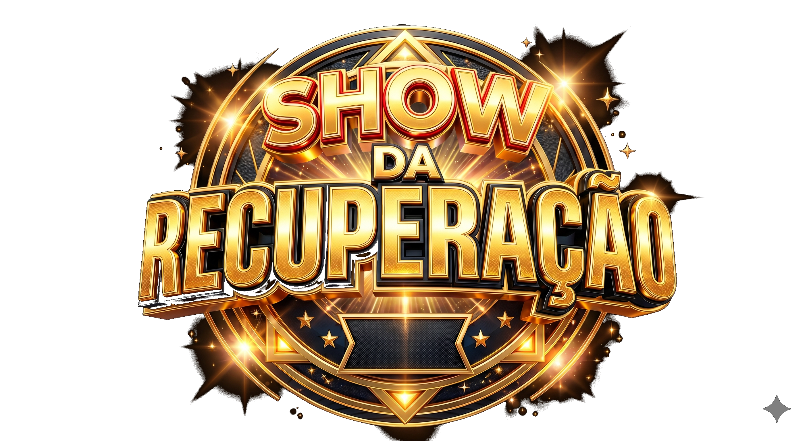

# ➕ Adição ao Projeto — Splash Screen e Sistema de Áudio

> **Para o agente de IA:** O projeto base já foi implementado (`guia-quiz-recuperacao.md`), assim como as adições de níveis de dificuldade (`adicao-niveis-dificuldade.md`) e grid de seleção de alunos (`adicao-grid-selecao-alunos.md`). Este documento descreve uma **nova adição**: tela de splash inicial e sistema completo de efeitos sonoros e trilha. Leia todo o documento antes de começar. Execute cada passo na ordem, confirmando com `✅ Passo X concluído` antes de avançar.
>
> **Não reescreva o que já existe.** Apenas modifique e adicione o que está descrito aqui.

---

## 📋 Contexto da Adição

Vamos adicionar:
1. Uma **tela de splash** (`splash.png`) exibida antes de tudo, com animação pulsante e música de fundo em loop. Um clique/tecla avança para a tela de seleção de jogadores (grid).
2. Um **sistema de áudio completo** que cobre efeitos sonoros para: acertar, errar, usar cada ajuda, resultado das cartas, parar/perder, nova pergunta, e trilha de fundo durante a pergunta.

### Onde estão os arquivos de mídia

Todos os arquivos estão na pasta `media/` do projeto (caminho relativo `./media/`). Os caminhos absolutos mencionados na descrição original (ex: `/home/r3dd/Documentos/recShow/recShow/media/...`) são apenas a localização no disco do desenvolvedor — **no código, sempre usar caminho relativo**:

```
media/
├── splash.png
├── acertou.mp3
├── ajuda.mp3
├── cartas.mp3
├── certo.mp3
├── errou.mp3
├── inicio.mp3
├── parou.mp3
├── pergunta.mp3
├── pulo.mp3
└── trilha.mp3
```

> **Verificação obrigatória:** antes de codificar, confirme que a pasta `media/` existe na raiz do projeto (mesmo nível de `index.html`) e contém todos os arquivos acima. Se a pasta estiver em outro lugar, copie/mova os arquivos para `media/` na raiz do projeto — não referencie caminhos absolutos do sistema operacional no código.

### Tabela-resumo de todos os sons e quando tocam

| Arquivo | Gatilho | Modo |
|---|---|---|
| `inicio.mp3` | Tela de splash, enquanto está visível | Loop, até confirmar jogador |
| `pergunta.mp3` | Toda vez que uma pergunta nova aparece (incluindo a primeira) | Uma vez |
| `trilha.mp3` | Começa imediatamente depois de `pergunta.mp3` terminar | Loop, até o jogador clicar em uma resposta ou em qualquer ajuda |
| `acertou.mp3` | Jogador acerta a pergunta | Uma vez |
| `errou.mp3` | Jogador erra a pergunta **e também** quando tira a carta 0 na ajuda Cartas | Uma vez |
| `parou.mp3` | Jogador clica em "Parar" **e também** depois de `errou.mp3` quando perde a partida | Uma vez |
| `ajuda.mp3` | Jogador usa a ajuda "Colegas" | Uma vez |
| `cartas.mp3` | Jogador abre a ajuda "Cartas" (ao clicar no botão, antes de revelar a carta) | Uma vez |
| `certo.mp3` | Resultado da carta é 1, 2 ou 3 (alguma eliminação ocorre) | Uma vez |
| `pulo.mp3` | Jogador usa a ajuda "Pulo" | Uma vez |

**Regra de sobreposição (trilha vs. efeitos):** ao tocar qualquer efeito sonoro (acertar, errar, ajudas), a `trilha.mp3` deve ser pausada imediatamente. Ao avançar para a próxima pergunta, o ciclo recomeça: `pergunta.mp3` toca, depois `trilha.mp3` entra em loop novamente.

**Regra do Pulo:** como o Pulo troca a pergunta mas **não avança a rodada/índice**, ele deve disparar o mesmo ciclo de uma pergunta nova: tocar `pulo.mp3` primeiro, e ao trocar a pergunta na tela, reiniciar o ciclo `pergunta.mp3` → `trilha.mp3`.

---

## 🎵 Passo A — Criar um módulo central de áudio em `audio.js`

Crie um novo arquivo `audio.js` na raiz do projeto. Ele vai centralizar todo o controle de som, evitando players duplicados ou sobrepostos.

```javascript
// audio.js — Módulo central de controle de áudio do jogo

const sons = {
  inicio:   new Audio('media/inicio.mp3'),
  pergunta: new Audio('media/pergunta.mp3'),
  trilha:   new Audio('media/trilha.mp3'),
  acertou:  new Audio('media/acertou.mp3'),
  errou:    new Audio('media/errou.mp3'),
  parou:    new Audio('media/parou.mp3'),
  ajuda:    new Audio('media/ajuda.mp3'),
  cartas:   new Audio('media/cartas.mp3'),
  certo:    new Audio('media/certo.mp3'),
  pulo:     new Audio('media/pulo.mp3'),
};

sons.inicio.loop = true;
sons.trilha.loop = true;

/**
 * Toca um som do zero (reinicia se já estiver tocando).
 */
function tocarSom(nome) {
  const audio = sons[nome];
  if (!audio) {
    console.warn(`Som "${nome}" não encontrado.`);
    return;
  }
  audio.currentTime = 0;
  audio.play().catch(err => console.warn(`Não foi possível tocar "${nome}":`, err));
}

/**
 * Para um som específico e reseta para o início.
 */
function pararSom(nome) {
  const audio = sons[nome];
  if (!audio) return;
  audio.pause();
  audio.currentTime = 0;
}

/**
 * Para todos os sons (usado em transições de tela).
 */
function pararTodosOsSons() {
  Object.keys(sons).forEach(nome => pararSom(nome));
}

/**
 * Toca pergunta.mp3 e, quando ele terminar, inicia trilha.mp3 em loop.
 * Deve ser chamado sempre que uma pergunta nova é exibida (incluindo trocas via Pulo).
 */
function iniciarCicloDePergunta() {
  pararSom('trilha'); // garantir que não haja sobreposição de uma trilha anterior
  tocarSom('pergunta');

  sons.pergunta.onended = () => {
    tocarSom('trilha');
  };
}

/**
 * Interrompe a trilha de fundo (chamado ao responder ou usar qualquer ajuda).
 */
function pararTrilha() {
  pararSom('trilha');
}
```

> **Importante:** `sons.pergunta.onended` é reatribuído a cada chamada de `iniciarCicloDePergunta()`. Isso é intencional e seguro — não acumula listeners duplicados.

---

## 🔗 Passo B — Importar `audio.js` nas páginas HTML

### Em `index.html`

Adicione a tag de script **antes** do `app.js`, já que o splash e a tela de seleção também usam som:

```html
<script src="audio.js"></script>
<script src="app.js"></script>
```

### Em `quiz.html`

Mesma coisa:

```html
<script src="audio.js"></script>
<script src="perguntas.js"></script>
<script src="app.js"></script>
```

> Ajuste a ordem conforme os scripts já existentes no projeto, garantindo apenas que `audio.js` carregue **antes** de `app.js` (pois `app.js` vai chamar as funções `tocarSom`, `pararSom`, etc.).

---

## 🖼️ Passo C — Criar a tela de Splash em `index.html`

A splash deve ser a **primeira coisa exibida**, antes até da grid de seleção de alunos (que foi implementada na adição anterior). Vamos adicionar uma terceira "tela" controlada da mesma forma que `tela-grid` e `tela-confirmacao` já existentes.

### HTML

Adicione no início do `<body>`, **antes** das seções `tela-grid` e `tela-confirmacao` já existentes:

```html
<section id="tela-splash" class="tela-ativa">
  <div class="splash-container">
    
    <p class="splash-instrucao">Clique ou pressione qualquer tecla para começar</p>
  </div>
</section>
```

> **Atenção:** como a splash passa a ser a primeira tela, ajuste a classe inicial das seções já existentes: `tela-grid` deve começar como `tela-oculta` (e não `tela-ativa` como está hoje), pois agora só aparece depois da splash. `tela-confirmacao` permanece `tela-oculta` como já está.

### CSS

Adicione ao `style.css`:

```css
.splash-container {
  display: flex;
  flex-direction: column;
  align-items: center;
  justify-content: center;
  height: 100vh;
  background-color: #1a1a1a;
  cursor: pointer;
}

.splash-imagem {
  max-width: 60%;
  max-height: 70vh;
  animation: pulsar 1.6s ease-in-out infinite;
}

@keyframes pulsar {
  0%   { transform: scale(1);    opacity: 1; }
  50%  { transform: scale(1.06); opacity: 0.85; }
  100% { transform: scale(1);    opacity: 1; }
}

.splash-instrucao {
  margin-top: 24px;
  font-size: 1.3rem;
  color: #03D92D;
  font-weight: bold;
  letter-spacing: 1px;
  animation: piscar 1.8s ease-in-out infinite;
}

@keyframes piscar {
  0%, 100% { opacity: 1; }
  50%      { opacity: 0.3; }
}
```

### JavaScript (em `app.js`)

```javascript
function inicializarSplash() {
  tocarSom('inicio'); // toca em loop (já configurado em audio.js)

  const avancar = () => {
    pararSom('inicio');
    document.removeEventListener('keydown', avancar);
    document.getElementById('tela-splash').removeEventListener('click', avancar);

    document.getElementById('tela-splash').classList.add('tela-oculta');
    document.getElementById('tela-splash').classList.remove('tela-ativa');

    exibirTelaGrid(); // função já existente da adição da grid de alunos
  };

  document.getElementById('tela-splash').addEventListener('click', avancar);
  document.addEventListener('keydown', avancar);
}
```

### Ajustar a inicialização da página

Localize a função que hoje roda ao carregar `index.html` (provavelmente `inicializarPaginaInicial()`, criada na adição da grid). Ajuste para que a splash seja o ponto de partida:

```javascript
// ANTES (da adição anterior):
// function inicializarPaginaInicial() {
//   // ler alunos.md...
//   exibirTelaGrid();
// }

// DEPOIS:
function inicializarPaginaInicial() {
  // ler alunos.md e popular listaDeAlunosGlobal (lógica já existente, não recriar)
  inicializarSplash(); // a grid só aparece depois que o usuário interagir com a splash
}
```

> **Nota sobre autoplay:** navegadores modernos costumam bloquear áudio com autoplay antes de qualquer interação do usuário. Se `tocarSom('inicio')` falhar silenciosamente no carregamento da página, isso é esperado — o catch já existente em `tocarSom()` evita erros no console. Caso queira garantir o som mesmo nesse cenário, adicione um fallback: tocar `inicio.mp3` também no primeiro clique/tecla, antes de chamar `avancar()`, usando um pequeno delay. Isso é opcional e só necessário se o som não estiver iniciando automaticamente nos testes.

---

## 🔊 Passo D — Integrar efeitos sonoros na tela do quiz (`quiz.html` / `app.js`)

Agora vamos conectar cada gatilho de som às funções já existentes do quiz (implementadas no guia original e nas adições anteriores). **Não recrie essas funções — apenas adicione as chamadas de som dentro delas.**

### D.1 — Nova pergunta exibida

Na função `renderizarPergunta()` (já existente), adicione no início da função:

```javascript
function renderizarPergunta() {
  iniciarCicloDePergunta(); // ADICIONAR: toca pergunta.mp3, depois trilha.mp3 em loop

  // ... resto da função já existente (exibir texto, alternativas, badge, etc.) ...
}
```

### D.2 — Jogador responde (acertou ou errou)

Na função `responder(alternativaSelecionada)` (já existente), adicione as chamadas de som no início e em cada branch:

```javascript
function responder(alternativaSelecionada) {
  pararTrilha(); // ADICIONAR: para a trilha de fundo imediatamente ao responder

  // ... lógica já existente que desabilita botões e verifica se é correta ...

  // 3a. Se CORRETA:
  //     ADICIONAR no início deste bloco:
  tocarSom('acertou');
  //     ... resto da lógica já existente (somar pontos, verificar última pergunta, etc.) ...

  // 3b. Se ERRADA:
  //     ADICIONAR no início deste bloco:
  tocarSom('errou');
  //     ... resto da lógica já existente (revelar correta, aguardar) ...
  //     ADICIONAR: depois do tempo de espera já existente (antes de exibirResultado),
  //     tocar o som de derrota:
  tocarSom('parou');
}
```

> **Atenção à ordem no caso de erro:** a descrição original pede `errou.mp3` e, na sequência, `parou.mp3`. Não toque os dois simultaneamente — `parou.mp3` deve iniciar **depois** que `errou.mp3` já tiver sido disparado (pode ser no mesmo `setTimeout` já existente que aguarda antes de exibir a tela de resultado, ou imediatamente após — desde que não se sobreponham de forma confusa).

### D.3 — Jogador clica em "Parar" (card de risco)

Na função `acaoParar()` (já existente), adicione no início:

```javascript
function acaoParar() {
  pararTrilha();
  tocarSom('parou');

  // ... resto da lógica já existente (exibir tela de resultado) ...
}
```

### D.4 — Jogador clica em "Errar" (card de risco / arriscar)

Na função `acaoErrar()` (já existente), adicione no início:

```javascript
function acaoErrar() {
  pararTrilha();
  tocarSom('errou');

  // ... resto da lógica já existente ...
}
```

> Não há instrução específica de som para este card além do padrão de erro — reaproveitamos `errou.mp3` por consistência com o nome do card. Se quiser um som diferente aqui, ajuste depois; por ora siga a tabela-resumo.

### D.5 — Ajuda "Colegas"

Na função `ajudaColegas()` (já existente), adicione no início:

```javascript
function ajudaColegas() {
  if (estado.ajudas.colegas <= 0) return;

  pararTrilha();
  tocarSom('ajuda');

  // ... resto da lógica já existente (decrementar contador, simular votação) ...
}
```

### D.6 — Ajuda "Cartas"

Na função `ajudaCartas()` (já existente), adicione a chamada de `cartas.mp3` no início (ao abrir a ajuda) e `certo.mp3` / `errou.mp3` conforme o resultado sorteado:

```javascript
function ajudaCartas() {
  if (estado.ajudas.cartas <= 0) return;

  pararTrilha();
  tocarSom('cartas'); // ADICIONAR: som ao abrir a ajuda das cartas

  // ... lógica já existente: decrementar contador, animação dos 4 quadrados,
  //     sortear a carta (0, 1, 2 ou 3) ...

  // ADICIONAR após o sorteio da carta, antes ou durante a revelação:
  if (cartaSorteada === 0) {
    tocarSom('errou'); // carta 0: nenhuma eliminação
  } else {
    tocarSom('certo'); // cartas 1, 2 ou 3: alguma eliminação ocorreu
  }

  // ... resto da lógica já existente (aplicar eliminação de alternativas) ...
}
```

> Use o nome de variável já existente no seu código para representar a carta sorteada (ex: `cartaSorteada`, `numeroCarta`, etc.) — ajuste a condição acima para o nome real usado na implementação.

### D.7 — Ajuda "Pulo"

Na função `ajudaPulo()` (já existente, modificada na adição de níveis de dificuldade), adicione a chamada de som e o reinício do ciclo de pergunta:

```javascript
function ajudaPulo() {
  if (estado.ajudas.pulo <= 0) return;

  pararTrilha();
  tocarSom('pulo'); // ADICIONAR

  // ... resto da lógica já existente (decrementar contador, buscar pergunta de
  //     nível inferior na reserva, substituir no array, etc.) ...

  renderizarPergunta();
  // NOTA: como renderizarPergunta() já chama iniciarCicloDePergunta() (Passo D.1),
  // o ciclo pergunta.mp3 → trilha.mp3 recomeça automaticamente para a pergunta nova.
  // Não é necessário adicionar nada extra aqui além de tocarSom('pulo') no início.

  atualizarBotoesAjuda();
}
```

---

## 🔇 Passo E — Parar todos os sons ao trocar de página

Para evitar que `inicio.mp3` continue tocando em loop depois de navegar para `quiz.html`, ou que sons fiquem tocando ao voltar para `index.html` a partir da tela de resultado, adicione a chamada de limpeza nos pontos de saída de página:

### Ao confirmar jogador e redirecionar para `quiz.html`

Localize a função do botão "Confirmar Jogador" (já existente) e adicione antes do redirecionamento:

```javascript
document.getElementById('btn-confirmar-jogador').addEventListener('click', () => {
  pararTodosOsSons(); // ADICIONAR

  // ... lógica já existente (salvar jogadorAtual no sessionStorage, redirecionar) ...
});
```

### Ao clicar em "Jogar Novamente" na tela de resultado

Localize o botão "Jogar Novamente" (já existente nas telas de resultado) e adicione antes do redirecionamento para `index.html`:

```javascript
// dentro do listener do botão "Jogar Novamente"
pararTodosOsSons(); // ADICIONAR
// ... redirecionamento já existente para index.html ...
```

---

## ✅ Passo F — Testar a adição

Execute os seguintes testes manuais para confirmar que tudo funciona:

1. Abrir `index.html` → confirmar que a **splash aparece primeiro**, com `splash.png` pulsando suavemente.
2. Confirmar que `inicio.mp3` toca em loop de fundo durante a splash (pode precisar de um clique inicial por causa do bloqueio de autoplay do navegador — ver nota do Passo C).
3. Clicar na splash (ou pressionar qualquer tecla) → confirmar que avança para a grid de alunos e que `inicio.mp3` para.
4. Selecionar um jogador e confirmar → checar que nenhum som da splash continua tocando em `quiz.html`.
5. Na primeira pergunta, confirmar que `pergunta.mp3` toca uma vez e, ao terminar, `trilha.mp3` entra em loop.
6. Clicar em uma alternativa correta → confirmar que `trilha.mp3` para e `acertou.mp3` toca uma vez.
7. Em outra tentativa, clicar em uma alternativa errada → confirmar que `errou.mp3` toca, seguido de `parou.mp3`, antes da tela de resultado.
8. Clicar no card "Parar" → confirmar que `parou.mp3` toca uma vez e a trilha para.
9. Clicar no card "Errar" (arriscar) → confirmar que `errou.mp3` toca uma vez e a trilha para.
10. Usar a ajuda "Colegas" → confirmar que `ajuda.mp3` toca uma vez.
11. Usar a ajuda "Cartas" → confirmar que `cartas.mp3` toca ao abrir, e depois `certo.mp3` (cartas 1/2/3) ou `errou.mp3` (carta 0), dependendo do resultado sorteado.
12. Usar a ajuda "Pulo" → confirmar que `pulo.mp3` toca, a pergunta muda, e o ciclo `pergunta.mp3` → `trilha.mp3` recomeça para a nova pergunta.
13. Completar uma partida (vitória, derrota ou parar) e clicar em "Jogar Novamente" → confirmar que nenhum som da partida anterior continua tocando ao voltar para a splash/grid.
14. Repetir o teste 2-3 vezes seguidas para garantir que os sons não acumulam (ex: múltiplas instâncias de `trilha.mp3` tocando ao mesmo tempo).
